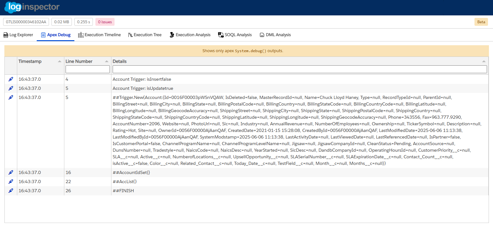
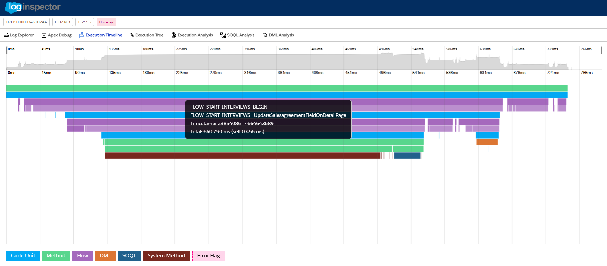
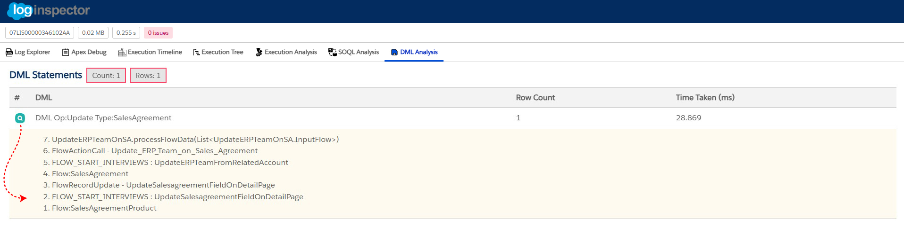

# ✨ Features

- 📑 **Row Log** - Easily view individual log rows with a quick find feature and a highlighted code theme for easier identification of key information.
- 🔤 **Debug Only** - This feature in Salesforce shows only `System.debug()` outputs, simplifying troubleshooting by excluding other log details.
- 🕒 **Timeline / Flame chart** - Gain an in-depth understanding of code execution over time with a timeline flame chart. Tooltips provide additional details about events for a deeper analysis of performance.
- 🌳 **Call Tree** - View the execution path in a tree view with aggregated DML Count, SOQL Count, Throws Count, Row Count, Self Time and Total Time.
- 🔍 **Analysis** - Quickly identify which methods consumed the most time in aggregate, helping you pinpoint performance bottlenecks and areas for optimization.
- 🛢️ **Database** - Identify which SOQL and DML executed the most, returned the most rows and took the most time.

## 📑 Row Log

View individual log rows with a quick find feature to quickly locate specific entries. The log rows are displayed with a highlighted code theme to make it easier to identify important sections of code, variables, and events. This feature helps you quickly navigate through logs and focus on relevant details for debugging.

## 🔤 Debug Only

The "Debug Only" option  is a specialized log view that shows only the output from `System.debug()` statements in Apex code. This feature is particularly useful for developers when they want to focus specifically on the debug output and exclude other details in the log that might distract from troubleshooting or analysis.

## 🕒 Timeline Chart

The timeline flame chart provides a visual representation of code execution over time. This helps you to understand how long each process takes and which actions are occurring in parallel. Tooltips display additional event details such as execution times and other relevant data, offering a deeper understanding of how the system is performing at any given point in time.

**On Zoom**
- Scroll up and down with the mouse to zoom in and out to an accuracy of 0.01ms, time markers are shown with a ms time value and graph view.
- When zooming the mouse pointer position is kept on screen.
- Scroll left and right on the mouse to move the time line left are right, when zoomed
- Click the mouse down and drag to move the timeline around both in the x and y direction, when zoomed

**On Hover**

Hovering over an element provides information on the item. tooltip provides the following information.
- **Event Name** - e.g `METHOD_ENTRY`, `EXECUTION_STARTED`, `SOQL_EXECUTION_BEGIN` etc
- **Event Description** - Additional information about the event such as method name or SOQL query executed.
- **Timestamp** - The start and end timestamp for the given event which can be cross referenced in the log file.
- **Duration** - Made up of Total Time (time spent in that event and its children) and Self Time (time directly spent in that event).
- **Rows** - Shows Total Rows (rows from that event and its children) and Self Rows (rows directly from that event).

## 🌳 Call Tree 

The call tree view offers a hierarchical representation of the execution path, showing which methods were called and how they relate to one another. It provides detailed metrics for each method, including:

- DML Count: How many DML operations were performed.
- SOQL Count: How many SOQL queries were executed.
- Throws Count: How many exceptions were thrown during execution.
- Row Count: The number of rows affected or returned by operations.
- Self Time: Time taken by the method itself (excluding calls to other methods).
- Total Time: Total time spent including calls to other methods.
- You can filter events to focus on specific methods or time periods, allowing you to drill down into critical areas of the log.

## 🔍 Analysis

The analysis feature helps you quickly identify the methods or operations that took the most time overall. By aggregating the time spent across methods, it provides a clear overview of performance bottlenecks, making it easy to prioritize areas for optimization. This can help you pinpoint which parts of the code are consuming the most resources and need attention.

## 🛢️ Database 

The database feature focuses on analyzing SOQL queries and DML operations. It shows you which queries:

- Executed the most (called queries/dml)
- Returned the most rows (helping identify inefficient queries/dml)
- Took the longest time to execute (allowing you to optimize slow-running queries) This feature helps you understand the database operations that are impacting performance, enabling you to optimize queries and improve efficiency.

---

`Happy Debugging`

 
