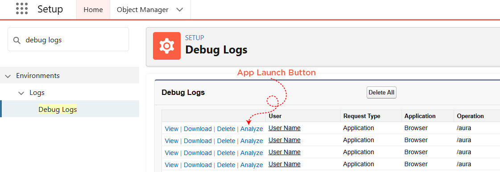
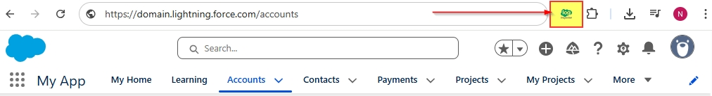
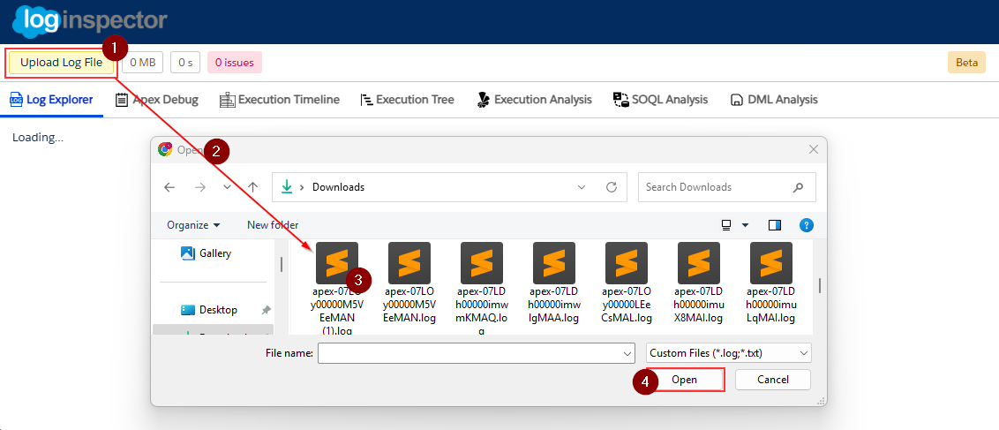

# Getting Started

Welcome to the Salesforce Debug Log Analyzer App! This application helps you easily analyze and debug Salesforce logs to quickly identify issues and optimize your workflows. Follow the steps below to get started and begin using the app.

Before you start using the app, ensure that you have:

- **Salesforce access**: You need access to a Salesforce account and permission to view debug logs.
- **App access**: The Salesforce Debug Log Analyzer app should be installed and available to you.

### How to launch

### 1. Access Salesforce Debug Logs
- Log in to your Salesforce account.
- Navigate to **Setup** (Click on the gear icon in the top right corner).
- In the **Quick Find** box, type **Debug Logs** and select **Debug Logs** under **Monitoring**.

### 2. Locate the Debug Log Entries
- Once you are on the Debug Logs page, you will see a list of generated debug logs for different users and actions.
- Find the log entry you want to analyze. This could be based on a specific user, time, or action.

### 3. Launch the App for Analysis
#### 1. Automatic
- For each log row in the list, there will be an **Analyze** button.
- Click the **Analyze** button next to the log entry you want to inspect. This will automatically launch the Salesforce Debug Log Analyzer app.

#### 2. Manual/Local File
- For each log row in the list, there will be an **Analyze** button.
- Click the **Analyze** button next to the log entry you want to inspect. This will automatically launch the Salesforce Debug Log Analyzer app.

### 4. Repeat for Other Logs
- If you need to analyze additional debug logs, simply return to the Salesforce Debug Logs page and click the **Analyze** button for the next log row. 
